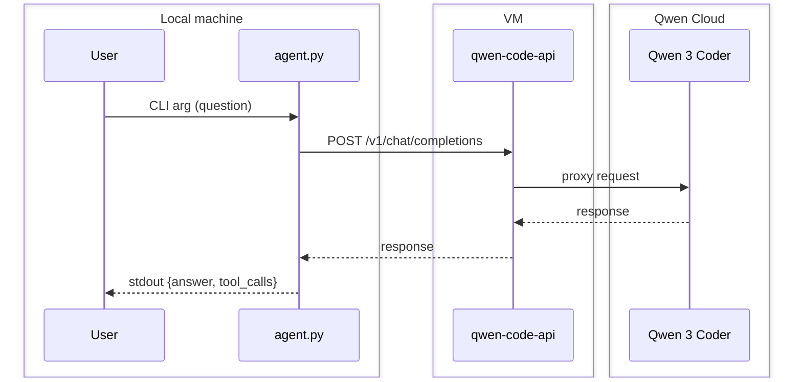

# Call an LLM from Code

Build a CLI that connects to an LLM and answers questions. This is the foundation for the agent you will build in the next tasks.

## What you will build

A `Python` CLI program (`agent.py`) that takes a question, sends it to an LLM, and returns a structured JSON answer. No tools or agentic loop yet — just the basic plumbing: parse input, call the LLM, format output. You will add tools and the agentic loop in Tasks 2–3.



**Input** — a question as the first command-line argument:

```bash
uv run agent.py "What does REST stand for?"
```

**Output** — a single JSON line to stdout:

```json
{"answer": "Representational State Transfer.", "tool_calls": []}
```

**Rules:**

- `answer` and `tool_calls` fields are required in the output.
- `tool_calls` is an empty array for this task (you will populate it in Task 2).
- Only valid JSON goes to stdout. All debug/progress output goes to **stderr**.
- The agent must respond within 60 seconds.
- Exit code 0 on success.

## How to get access to an LLM?

Your agent needs an LLM that supports the OpenAI-compatible chat completions API. You are free to use any provider.

**Recommended: [Set up the Qwen Code API on your VM](../../../wiki/qwen-code-api-deployment.md#deploy-the-qwen-code-api-remote)**

[Qwen Code](../../../wiki/qwen-code.md#what-is-qwen-code) provides **1000 free requests per day**, works from Russia, and requires no credit card.

Follow the [setup instructions](../../setup/setup-simple.md#17-deploy-the-qwen-code-api) to deploy it on your VM.

| Model              | Tool calling | Notes                                        |
| ------------------ | ------------ | -------------------------------------------- |
| `coder-model`      | Strong       | Qwen 3.5 Plus                                |

<details><summary><b>Alternative: OpenRouter (click to open)</b></summary>

[OpenRouter](https://openrouter.ai) offers free models with no credit card required.

| Model                                    | Tool calling | Notes            |
| ---------------------------------------- | ------------ | ---------------- |
| `meta-llama/llama-3.3-70b-instruct:free` | Strong       | Good alternative |
| `qwen/qwen3-coder:free`                  | Good         | Alternative      |

> [!WARNING]
> **OpenRouter free-tier limitations:**
>
> - Free models have a **50 requests per day** limit per account.
> - Free models can be **temporarily unavailable** due to upstream provider load (`429` errors).
> - The autochecker runs 10 questions against your agent — free-tier rate limits may cause failures.
> - If you use OpenRouter, plan your testing carefully: use `run_eval.py --index N` to test one question at a time.

</details>

Create the agent environment file:

```bash
cp .env.agent.example .env.agent.secret
```

Edit `.env.agent.secret` and fill in `LLM_API_KEY`, `LLM_API_BASE_URL`, and `LLM_API_MODEL`. Your agent reads from this file.

> **Note:** This is **not** the same as `LMS_API_KEY` in `.env.docker.secret`. That one protects your backend LMS endpoints. `LLM_API_KEY` authenticates with your LLM provider.

## Deliverables

### 1. Plan (`plans/task-1.md`)

Before writing code, create `plans/task-1.md`. Describe which LLM provider and model you will use, and how you will structure the agent.

### 2. Agent (`agent.py`)

Create `agent.py` in the project root. The system prompt can be minimal for now — you will expand it in later tasks when you add tools and domain knowledge.

### 3. Documentation (`AGENT.md`)

Create `AGENT.md` in the project root documenting how the agent works, which LLM provider you chose, and how to run it.

### 4. Tests (1 test)

Create 1 regression test that runs `agent.py` as a subprocess, parses the stdout JSON, and checks that `answer` and `tool_calls` are present.

## Acceptance criteria

- [ ] `plans/task-1.md` exists with the implementation plan (committed before code).
- [ ] `agent.py` exists in the project root.
- [ ] `uv run agent.py "..."` outputs valid JSON with `answer` and `tool_calls`.
- [ ] The API key is stored in `.env.agent.secret` (not hardcoded).
- [ ] `AGENT.md` documents the solution architecture.
- [ ] 1 regression test exists and passes.
- [ ] [Git workflow](../../../wiki/git-workflow.md): issue `[Task] Call an LLM from Code`, branch, PR with `Closes #...`, partner approval, merge.
